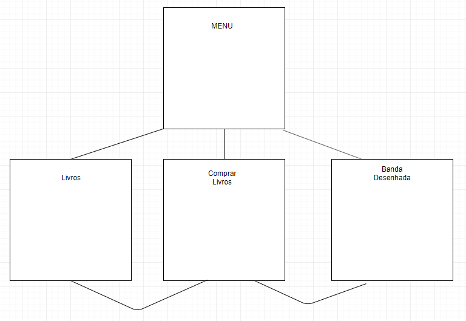

A minha aplicação consiste em ver e puder comprar livros e banda desenhada. Neste modo vou ter as duas tabelas Livros e Banda Desenhada
relacionada com a tabela de Compras.

Tabelas: 
Tabela Livros
Tabela Compras
Tabela Banda Desenhada

